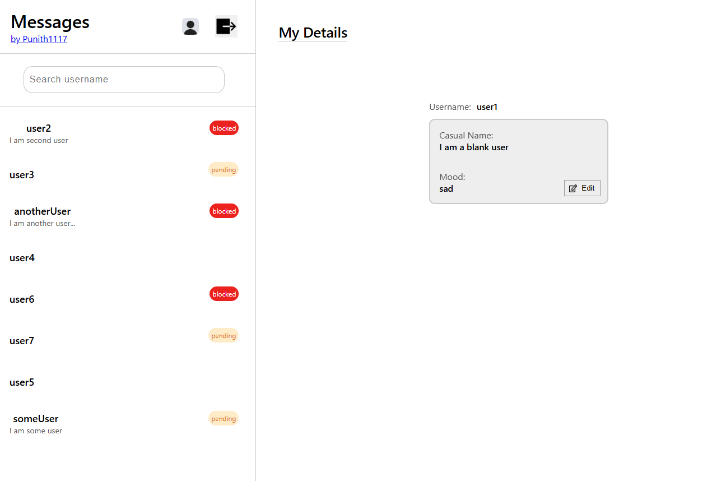
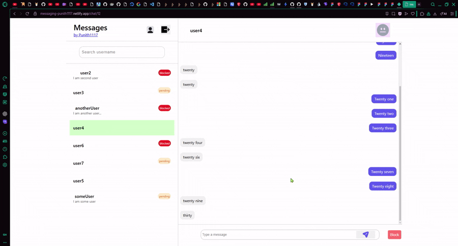

# Messaging App – Frontend

A chat application frontend built with **React + Vite**, focused on real-world problems like **chat invitations, pagination, and debounced search**.

This repo contains only the frontend of the project and communicates with a [REST API backend](https://github.com/Punith1117/messaging). For the first time, I used figma to visualize before coding.

---

## ✨ Features

### 🔐 Authentication

* Login & Signup flows
* JWT-based authentication (short-lived tokens handled on backend)
* Protected routes for authenticated users

### 💬 Messaging System

* Search users **only by username**
* Send a first message as a **chat invitation**
* Messaging is blocked until the receiver **accepts** the invite
* Supports accepted, pending, and blocked chat states

### 🧠 Chat Logic Awareness

* UI adapts based on chat status (pending / accepted / blocked)
* Prevents users from messaging themselves
* Graceful handling of empty states and edge cases

### 📜 Message Pagination (Cursor-based)

* Messages are fetched in chunks using cursor-based pagination
* Older messages load when scrolling up
* Designed to work efficiently without fetching the entire chat history

> This feature highlighted real-world UX challenges, and helped me deeply understand scroll containers, layout constraints, and pagination strategies.

### 🔍 Debounced User Search

* Search input is **debounced** to avoid excessive API calls
* Improves performance and prevents unnecessary backend load
* Search results only return minimal user info (id + username)

### 👤 User Profile

* Optional **casual name** for better identity
* User mood (happy / sad / angry / neutral)
* Mood visibility depends on chat relationship status

---

## 🛠️ Tech Stack

* **React**
* **Vite** (Fast dev & build tooling)
* **Styled Components** (CSS-in-JS, no Tailwind)
* **React Router** (Client-side routing)
* **Pure JavaScript**
* **REST API**

---

## 📹 Demo

  

  

## 🌐 Deployment

* Deployed using **Netlify**
* Includes `_redirects` configuration to support client-side routing

#### Try it out now: https://messaging-punith1117.netlify.app/
---

## 📌 Key Learnings

* Cursor-based pagination is harder than it looks—especially in chat UIs
* Scroll behavior differs significantly between desktop and mobile
* Debouncing is essential for search-heavy interfaces
* UI must actively reflect backend rules (chat status, permissions)
* Building full features > reading documentation endlessly

---

## 🔗 Related Repositories

* **Backend Repo**: *https://github.com/Punith1117/messaging*
